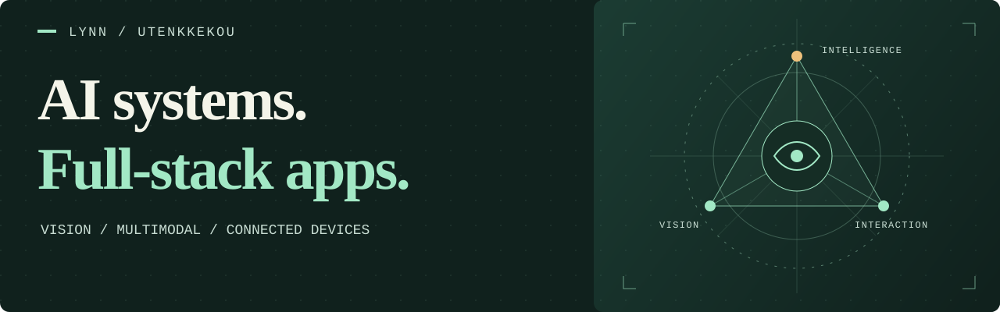

<a href="https://github.com/utenkkekou">中文</a> &nbsp; / &nbsp; <strong>English</strong> &nbsp; / &nbsp; <a href="https://github.com/utenkkekou/utenkkekou/blob/main/README.ja.md">日本語</a>

  

## Hi, I'm lynn

**AI applications · Computer vision · Full-stack & mobile development**

My project work spans multimodal inference, computer vision, business applications, mobile apps and connected devices, alongside data-processing and interactive 3D tools.

---

### 01 / Capabilities

| Area | Project experience |
| --- | --- |
| **AI & multimodal systems** | Unified inference APIs, model integration, text/image/speech/video processing, streaming responses, tool calling and workflow orchestration. |
| **Computer vision** | Image pre-annotation and human review, YOLO training and evaluation, detection and segmentation, ONNX inference and on-device Core ML integration. |
| **Full-stack applications** | Web dashboards, API services, role-based access, tenant isolation, and file and media asset management. |
| **Mobile & connected devices** | Flutter, React Native and native iOS development; camera, location and BLE integration, plus H.264 video and real-time audio communication. |
| **Data processing & reporting** | Structured data modeling, CSV/Excel import and cleaning, business report generation, and document upload and processing. |
| **Visualization & interaction** | Three.js scenes, floor-plan and spatial visualization, data dashboards, visual workflows and content-creation interfaces. |
| **Engineering & delivery** | Docker deployment, database migrations, asynchronous jobs, WebSocket communication, monitoring metrics and automated tests. |

### 02 / Selected work

<table>
  <tr>
    <td width="50%" valign="top">
      <h3><a href="https://github.com/utenkkekou/Quick-Annotation">Quick Annotation ↗</a></h3>
      
Traffic-light image pre-annotation and human review, with a vision API and a browser-based review workflow.

      
Python · Vision models · Annotation

    </td>
    <td width="50%" valign="top">
      <h3><a href="https://github.com/utenkkekou/AI-">AI Short-Drama Studio ↗</a></h3>
      
An application prototype exploring AI-assisted short-drama generation for original creative projects.

      
TypeScript · Generative AI

    </td>
  </tr>
  <tr>
    <td width="50%" valign="top">
      <h3><a href="https://github.com/utenkkekou/3D-">3D Mechanics ↗</a></h3>
      
Experiments in visualizing mechanical relationships through interactive three-dimensional scenes.

      
3D · Visualization · Interaction

    </td>
    <td width="50%" valign="top">
      <h3>AI Smart Glasses</h3>
      
An assistive system in development for people with visual impairments, connecting visual perception, voice interaction and mobile apps.

      
Computer vision · Voice · Accessibility

    </td>
  </tr>
</table>

### 03 / Tech stack

**Languages**

**AI & computer vision**

**Web & visualization**

**Backend & APIs**

**Mobile**

**Data & infrastructure**

Additional project tools: FFmpeg, pandas, openpyxl, Hono, Cloudflare Workers, pytest and Playwright.

### 04 / Currently exploring

- **Vector retrieval & knowledge modeling** — pgvector data models, text-embedding interfaces and retrieval prototypes.
- **Desktop applications** — Electron client prototypes and desktop integration for web applications.
- **Spatial recognition & edge AI** — floor-plan-to-3D recognition pipelines, model quantization and on-device inference optimization.
