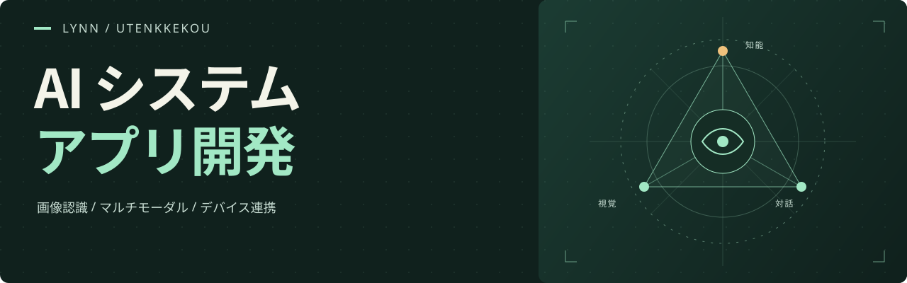

<a href="https://github.com/utenkkekou">中文</a> &nbsp; / &nbsp; <a href="https://github.com/utenkkekou/utenkkekou/blob/main/README.en.md">English</a> &nbsp; / &nbsp; <strong>日本語</strong>

  

## こんにちは、lynn です

**AI アプリケーション · コンピュータビジョン · フルスタック・モバイル開発**

マルチモーダル推論、画像認識、業務システム、モバイルアプリ、デバイス連携を中心に、データ処理や 3D インタラクションのツールにも取り組んでいます。

---

### 01 / 開発経験

| 分野 | プロジェクトでの経験 |
| --- | --- |
| **AI・マルチモーダルシステム** | 推論 API の統合、複数モデルの連携、テキスト・画像・音声・動画処理、ストリーミング応答、ツール呼び出し、ワークフロー構築。 |
| **コンピュータビジョン** | 画像の事前アノテーションと人手レビュー、YOLO の学習・評価、物体検出・セグメンテーション、ONNX 推論、Core ML の端末内統合。 |
| **フルスタック業務アプリ** | Web 管理画面、API サービス、ロールに基づく権限制御、テナント分離、ファイル・メディア資産の管理。 |
| **モバイル・デバイス連携** | Flutter、React Native、ネイティブ iOS 開発。カメラ・位置情報・BLE の連携、H.264 映像とリアルタイム音声の通信。 |
| **データ処理・レポート** | 構造化データのモデリング、CSV・Excel の取り込みと整形、業務レポート生成、ドキュメントのアップロードと処理。 |
| **可視化・インタラクション** | Three.js のシーン、間取り・空間の可視化、ダッシュボード、ビジュアルワークフロー、コンテンツ制作画面。 |
| **開発・運用基盤** | Docker によるデプロイ、DB マイグレーション、非同期ジョブ、WebSocket 通信、監視メトリクス、自動テスト。 |

### 02 / 主なプロジェクト

<table>
  <tr>
    <td width="50%" valign="top">
      <h3><a href="https://github.com/utenkkekou/Quick-Annotation">Quick Annotation ↗</a></h3>
      
信号機画像の事前アノテーションと人手レビューを支援。画像認識 API とブラウザ上のレビュー画面を連携します。

      
Python · 画像認識 · アノテーション

    </td>
    <td width="50%" valign="top">
      <h3>AI スマートグラス</h3>
      
視覚障害のある方を支援するシステムを開発中。視覚認識、音声対話、モバイルアプリを連携します。

      
画像認識 · 音声 · アクセシビリティ

    </td>
  </tr>
</table>

### 03 / 技術スタック

**プログラミング言語**

**AI・コンピュータビジョン**

**Web・可視化**

**バックエンド・API**

**モバイル**

**データ・インフラ**

その他の使用ツール：FFmpeg、pandas、openpyxl、Hono、Cloudflare Workers、pytest、Playwright。

### 04 / 現在取り組んでいること

- **ベクトル検索・知識モデリング** — pgvector のデータモデル、テキスト埋め込み API、検索プロトタイプ。
- **デスクトップアプリ** — Electron クライアントの試作と Web アプリのデスクトップ統合。
- **空間認識・エッジ AI** — 間取り図から 3D への認識処理、モデル量子化、端末内推論の最適化。
