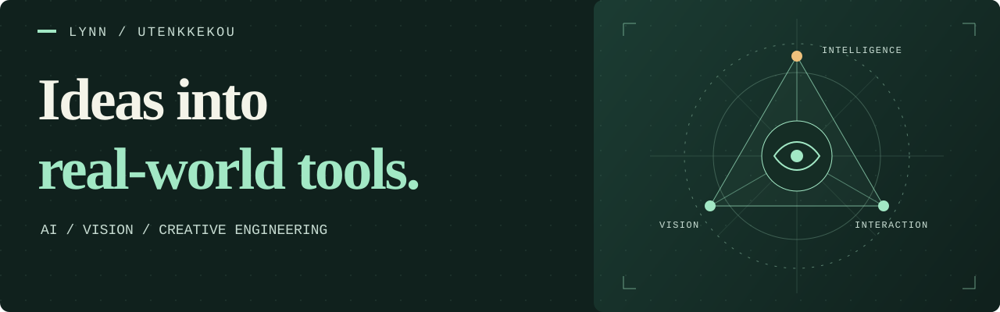

<strong>中文</strong> &nbsp; / &nbsp; <a href="https://github.com/utenkkekou/utenkkekou/blob/main/README.en.md">English</a> &nbsp; / &nbsp; <a href="https://github.com/utenkkekou/utenkkekou/blob/main/README.ja.md">日本語</a>

  

## 你好，我是 lynn

**AI 应用 · 计算机视觉 · 全栈与移动端开发**

项目实践覆盖多模态推理、视觉模型、业务管理系统、移动应用与智能设备，也在开发数据处理和 3D 交互工具。

---

### 01 / 能力范围

| 方向 | 项目实践 |
| --- | --- |
| **AI 系统与多模态** | 统一推理 API、多模型接入、文本／图像／语音／视频处理、流式响应、工具调用与工作流编排。 |
| **计算机视觉** | 图片预标注与人工审核、YOLO 训练与评估、目标检测与分割、ONNX 推理及 Core ML 端侧集成。 |
| **全栈业务应用** | Web 管理后台、API 服务、角色权限、租户隔离、文件与媒体资产管理。 |
| **移动端与设备联动** | Flutter、React Native 与原生 iOS 开发；相机、定位、BLE 接入及 H.264 视频与实时音频通信。 |
| **数据处理与报表** | 结构化数据建模、CSV／Excel 导入清洗、业务报表生成、文档上传与处理。 |
| **可视化与交互** | Three.js 场景、户型与空间可视化、图表大屏、可视化工作流和内容创作界面。 |
| **工程交付** | Docker 部署、数据库迁移、异步任务、WebSocket 通信、监控指标与自动化测试。 |

### 02 / 精选项目

<table>
  <tr>
    <td width="50%" valign="top">
      <h3><a href="https://github.com/utenkkekou/core-nexus-ai">Core Nexus AI ↗</a></h3>
      
多模态 AI 推理网关，统一模型适配、流式响应、鉴权与任务编排，提供离线演示。

      
Python · FastAPI · 多模态 AI

    </td>
    <td width="50%" valign="top">
      <h3><a href="https://github.com/utenkkekou/PTL-Detect">PTL-Detect ↗</a></h3>
      
行人红绿灯视觉工具链，覆盖图片标注、数据复核、YOLO 训练与误判分析。

      
Python · YOLO · 计算机视觉

    </td>
  </tr>
  <tr>
    <td width="50%" valign="top">
      <h3><a href="https://github.com/utenkkekou/Quick-Annotation">Quick Annotation ↗</a></h3>
      
交通信号灯图片预标注与人工审核工具，连接视觉 API，在浏览器中完成逐张审核。

      
Python · 视觉模型 · 数据标注

    </td>
    <td width="50%" valign="top">
      <h3>AI 智能眼镜</h3>
      
正在开发面向视障用户的辅助系统，连接视觉感知、语音交互与移动端。

      
计算机视觉 · 语音 · 无障碍

    </td>
  </tr>
</table>

### 03 / 技术栈

**编程语言**

**AI 与计算机视觉**

**Web 与可视化**

**后端与接口**

**移动端**

**数据与基础设施**

其他项目工具：FFmpeg、pandas、openpyxl、Hono、Cloudflare Workers、pytest、Playwright。

### 04 / 正在探索

- **向量检索与知识建模** — pgvector 数据模型、文本嵌入接口与检索原型。
- **桌面端应用** — Electron 客户端原型与 Web 应用的桌面集成。
- **空间识别与端侧 AI** — 户型图到 3D 的识别流程、模型量化与设备端推理优化。
